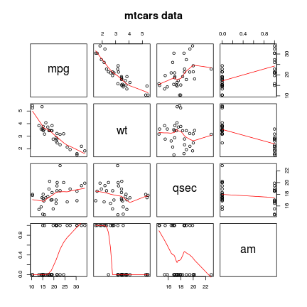
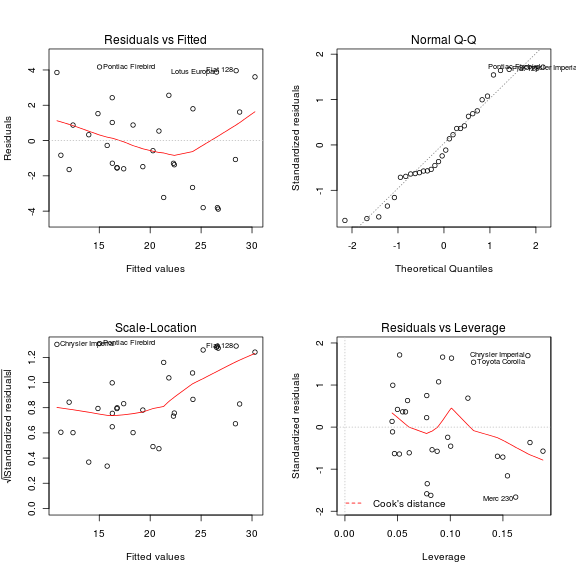

Is an automatic or manual transmission better for MPG ?
========================================================
  
  ## Summary
  
  The essense of this study was exploring the relationship bewteen a set of variable in tht mtcars datase taken from and miles per gallon (MPG) parameter as an outcome. Paricularly, the bigest attention has beenn taken in annsweringn the followingn two questions:

* Is an automatic or manual transmission better for miles/(US) gallon (MPG) ?
* Quantifying how different is the MPG between automatic and manual transmissions?

The analysis required for ansnweringn these two questions contained of three parts:
* setting the statistical frame of these problems
* using the *backward-elimination* strategy to choose the best fit model
* comparing the final model to different diagnostic tools and visualizing the data and residuals.

## Statistical Frame
Our dataset `mtcars` contains **32** observations of the following **11** variables.
* [, 1]  `mpg`   Miles/(US) gallon
* [, 2]	 `cyl`	 Number of cylinders
* [, 3]	 `disp`	 Displacement (cu.in.)
* [, 4]	 `hp`	 Gross horsepower
* [, 5]	 `drat`	 Rear axle ratio
* [, 6]	 `wt`	 Weight (lb/1000)
* [, 7]	 `qsec`	 1/4 mile time
* [, 8]	 `vs`	 V/S
* [, 9]	 `am`	 Transmission (0 = automatic, 1 = manual)
* [,10]	 `gear`	 Number of forward gears
* [,11]	 `carb`	 Number of carburetors

We can frame this into a **two-sided statistical hypothesis test** :
  
  $H_O$ : $\beta_1 = 0$. The true linear model has the slope zero for `am`, which means that the transmission mode does not relate to the number of miles per gallon of the car.

$H_A$ : $\beta_1 \neq 0$. The true linear model has the slope different from zero for `am`. If $\beta_1$ is positive, it means manual transmission can have $\beta_1$ **more** mpg in comparison with automatic mode. If $\beta_1$ is negative, the manual transmission will have $\beta_1$ **less** mpg than automatic mode.


## Model Selection

Let's first do a multivarible regression as following

```r
summary(lm(mpg ~ ., data = mtcars))$coefficients
```

```
##             Estimate Std. Error t value Pr(>|t|)
## (Intercept) 12.30337   18.71788  0.6573  0.51812
## cyl         -0.11144    1.04502 -0.1066  0.91609
## disp         0.01334    0.01786  0.7468  0.46349
## hp          -0.02148    0.02177 -0.9868  0.33496
## drat         0.78711    1.63537  0.4813  0.63528
## wt          -3.71530    1.89441 -1.9612  0.06325
## qsec         0.82104    0.73084  1.1234  0.27394
## vs           0.31776    2.10451  0.1510  0.88142
## am           2.52023    2.05665  1.2254  0.23399
## gear         0.65541    1.49326  0.4389  0.66521
## carb        -0.19942    0.82875 -0.2406  0.81218
```

We will then use the **backward-elimination** strategy to eliminate the unrelated variables one-at-a-time. It means, we first fit a model which includes all the potential variables as above, now we drop the variable `cyl` as it has the largest p-value, then we refit the model. All the details of the model selection are attached in Appendix A.

In the new model, there is no strong evidence that the coefficient of the variable `vs` is different from zero even though its p-value decreased a little bit, so we again eliminate the variable with the largest p-value `vs` and refit the model

With the same strategy, we can now eliminate the variable largest p-value as `carb`, `gear`, `drat` `disp`, `hp` and the intercept in order and refit the model. The final model is

```r
dat <- mtcars[, c("mpg", "wt", "qsec", "am")]
fit <- lm(mpg ~ . - 1, data = dat)
summary(fit)$coefficients
```

```
##      Estimate Std. Error t value  Pr(>|t|)
## wt     -3.185     0.4828  -6.598 3.129e-07
## qsec    1.600     0.1021  15.665 1.092e-15
## am      4.300     1.0241   4.198 2.329e-04
```

It includes only `wt`, `qsec` and `am` in predicting the miles per gallon of a vehicle
$$
\hat y = -3.1855 x_{wt} + 1.5998 x_{qsec} + 4.2995 x_{am}
$$
Where $x_{wt}$, $x_{qsec}$ and $x_{am}$ represent the variables `wt`, `qsec` and `am`.

As the two-sided p-value for the coefficient of `am` is 2.3294 &times; 10<sup>-4</sup>, much smaller than 0.05, we have enough evidence to reject the hypothesis $H_0$.

## Exploratory Analysis

Before we draw a conclusion of the final model obtained, we can check the relation between `mpg` and the three variables in our final model again.

```r
pairs(dat, panel = panel.smooth, main = "mtcars data")
```

 

As shown in the figure above, the linear relationship bewteen `mpg` and the three variables is quite strong. We can also plot the residual and other variations of the final fit

```r
par(mfrow = c(2, 2))
plot(fit)
```

 

We note that the residuals show no obvious pattern, so it is reasonable to try to fit a linear model to the data.

## Conclusion
Now with all the previous analysis, we can conclude that our linear model is a resonable fit. As

```r
sumCoef <- summary(fit)$coefficients
intv <- sumCoef["am", 1] + c(-1, 1) * qt(0.975, df = fit$df) * sumCoef["am", 
    2]
intv
```

```
## [1] 2.205 6.394
```

With 95% confidence, we estimate that a the change from automatic to manual transmission results in a 2.2 to 6.39 increase in miles per gallon for the cars. In conclusion, the manual transmission is better than automatic transmission for mpg.

-----------
## Appendix A. Model Selection Details

```r
dat <- mtcars
dat <- dat[, names(dat) != "cyl"]
summary(lm(mpg ~ ., data = dat))$coefficients
```

```
##             Estimate Std. Error t value Pr(>|t|)
## (Intercept) 10.96007   13.53030  0.8100  0.42659
## disp         0.01283    0.01682  0.7626  0.45381
## hp          -0.02191    0.02091 -1.0477  0.30615
## drat         0.83520    1.53625  0.5437  0.59214
## wt          -3.69251    1.83954 -2.0073  0.05716
## qsec         0.84244    0.68678  1.2267  0.23292
## vs           0.38975    1.94800  0.2001  0.84326
## am           2.57743    1.94035  1.3283  0.19768
## gear         0.71155    1.36562  0.5210  0.60754
## carb        -0.21958    0.78856 -0.2785  0.78326
```

```r
dat <- dat[, names(dat) != "vs"]
summary(lm(mpg ~ ., data = dat))$coefficients
```

```
##             Estimate Std. Error t value Pr(>|t|)
## (Intercept)  9.76828   11.89230  0.8214  0.41985
## disp         0.01214    0.01612  0.7532  0.45897
## hp          -0.02095    0.01993 -1.0514  0.30399
## drat         0.87510    1.49113  0.5869  0.56301
## wt          -3.71151    1.79834 -2.0639  0.05049
## qsec         0.91083    0.58312  1.5620  0.13195
## am           2.52390    1.88128  1.3416  0.19283
## gear         0.75984    1.31577  0.5775  0.56922
## carb        -0.24796    0.75933 -0.3266  0.74696
```

```r
dat <- dat[, names(dat) != "carb"]
summary(lm(mpg ~ ., data = dat))$coefficients
```

```
##             Estimate Std. Error t value Pr(>|t|)
## (Intercept)  9.19763   11.54220  0.7969 0.433340
## disp         0.01552    0.01214  1.2782 0.213420
## hp          -0.02471    0.01596 -1.5478 0.134763
## drat         0.81023    1.45007  0.5588 0.581508
## wt          -4.13065    1.23593 -3.3421 0.002717
## qsec         1.00979    0.48883  2.0657 0.049815
## am           2.58980    1.83528  1.4111 0.171042
## gear         0.60644    1.20596  0.5029 0.619641
```

```r
dat <- dat[, names(dat) != "gear"]
summary(lm(mpg ~ ., data = dat))$coefficients
```

```
##             Estimate Std. Error t value Pr(>|t|)
## (Intercept)  10.7106   10.97539  0.9759 0.338475
## disp          0.0131    0.01098  1.1930 0.244054
## hp           -0.0218    0.01465 -1.4875 0.149381
## drat          1.0207    1.36748  0.7464 0.462401
## wt           -4.0445    1.20558 -3.3548 0.002536
## qsec          0.9907    0.48002  2.0639 0.049551
## am            2.9847    1.63382  1.8268 0.079692
```

```r
dat <- dat[, names(dat) != "drat"]
summary(lm(mpg ~ ., data = dat))$coefficients
```

```
##             Estimate Std. Error t value Pr(>|t|)
## (Intercept) 14.36190     9.7408   1.474 0.152378
## disp         0.01124     0.0106   1.060 0.298972
## hp          -0.02117     0.0145  -1.460 0.156387
## wt          -4.08433     1.1941  -3.420 0.002075
## qsec         1.00690     0.4754   2.118 0.043908
## am           3.47045     1.4858   2.336 0.027488
```

```r
dat <- dat[, names(dat) != "disp"]
summary(lm(mpg ~ ., data = dat))$coefficients
```

```
##             Estimate Std. Error t value Pr(>|t|)
## (Intercept) 17.44019    9.31887   1.871 0.072149
## hp          -0.01765    0.01415  -1.247 0.223088
## wt          -3.23810    0.88990  -3.639 0.001141
## qsec         0.81060    0.43887   1.847 0.075731
## am           2.92550    1.39715   2.094 0.045791
```

```r
dat <- dat[, names(dat) != "hp"]
summary(lm(mpg ~ ., data = dat))$coefficients
```

```
##             Estimate Std. Error t value  Pr(>|t|)
## (Intercept)    9.618     6.9596   1.382 1.779e-01
## wt            -3.917     0.7112  -5.507 6.953e-06
## qsec           1.226     0.2887   4.247 2.162e-04
## am             2.936     1.4109   2.081 4.672e-02
```

```r
summary(lm(mpg ~ . - 1, data = dat))$coefficients
```

```
##      Estimate Std. Error t value  Pr(>|t|)
## wt     -3.185     0.4828  -6.598 3.129e-07
## qsec    1.600     0.1021  15.665 1.092e-15
## am      4.300     1.0241   4.198 2.329e-04
```

As the p-value of all the remaining predictors are smaller than $0.05$, we can stop.
